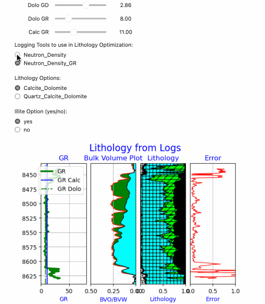

# Geolog-Project-with-Interactive-Pickett-Plot-and-Lithology-Optimization-Using-Python-Loglans
This repository includes a Geolog Project with Interactive Pickett Plot and Lithology Optimization performed within Geolog using python loglans.

This is an example of the Interactive Lithology Optimization using SciPy optimization to arrive at the final lithology where we are using Panel for the interactivity:
>
>
>
This is an example of the Interactive Pickett Plot using Panel again.
>
>
>
For our Juputer Notebook we can use IPwidedgets for the interactive plots, but outside of Jupyter Notebooks we use Panel.
